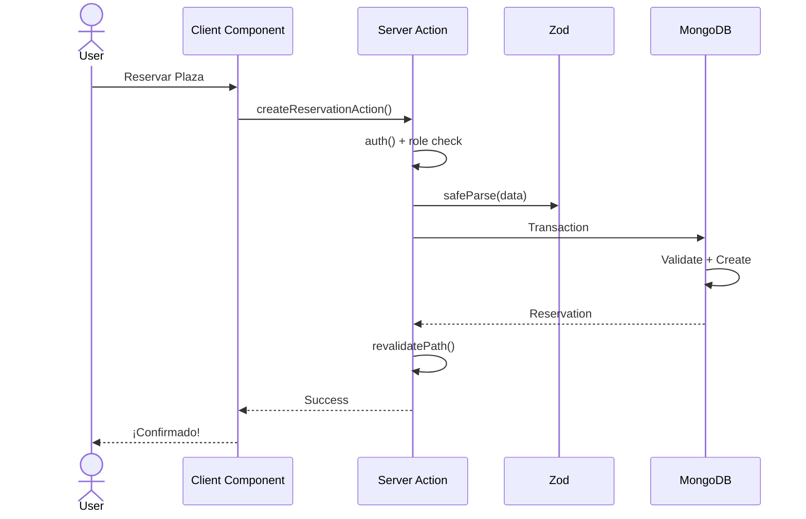

# 🅖 Gruposiete Parking

    

## 📋 Descripción

Sistema de **reservas inteligente** para plazas de parking (subterráneas y exteriores) de Grupo Siete. Permite a los empleados gestionar sus reservas de manera eficiente, con un control administrativo basado en roles y validaciones robustas que garantizan la disponibilidad y el uso óptimo de los espacios.

Desarrollado con **Next.js 16**, **TypeScript** y **MongoDB**, implementa autenticación segura mediante **NextAuth** y un sistema de transacciones que previene conflictos en reservas concurrentes.

---

## 🏗️ Arquitectura Técnica

### Diagrama de Flujo

El siguiente diagrama muestra el flujo simplificado de una petición de reserva mediante **Server Actions**:

### Capas del Sistema

| Capa               | Tecnología             | Responsabilidad                                     |
| ------------------ | ---------------------- | --------------------------------------------------- |
| **Server Actions** | Next.js Server Actions | Lógica del servidor invocable desde el cliente      |
| **Auth**           | NextAuth v5            | Validación de sesión y protección de rutas          |
| **Validation**     | Zod                    | Validación estricta de tipos y formatos             |
| **Business Logic** | TypeScript             | Reglas de negocio (días laborables, fechas válidas) |
| **Persistence**    | MongoDB + Mongoose     | Transacciones ACID para prevenir race conditions    |

### Stack Tecnológico

| Categoría     | Tecnología                   |
| ------------- | ---------------------------- |
| Framework     | Next.js 16 (App Router)      |
| Lenguaje      | TypeScript                   |
| Base de Datos | MongoDB Atlas + Mongoose ODM |
| Autenticación | NextAuth v5                  |
| Validación    | Zod                          |
| Estilos       | Tailwind CSS v4              |
| Componentes   | Radix UI Primitives          |
| Animaciones   | Framer Motion                |
| Email         | Resend                       |
| Testing       | Vitest                       |

## ⚡ Características Principales

- **Autenticación Segura**: Sistema de login con validación de emails corporativos y recuperación de contraseña
- **Server Actions**: Lógica de servidor eficiente y tipo-segura sin API intermedia
- **Transacciones MongoDB**: Previene race conditions en reservas concurrentes mediante reintentos exponenciales
- **UI Moderna y Responsiva**: Diseño con Tailwind CSS y componentes Radix UI
- **Sistema de Roles**: Tres niveles de acceso (GENERAL, DIRECCION, ADMIN) con dashboards diferenciados
- **Notificaciones Email**: Envío automático de confirmaciones mediante Resend
- **Aplicación PWA**: Mejoras en rendimiento y experiencia de usuario

---

## 🚀 Funcionalidades

### 👤 Usuario General

- Reservar y cancelar plazas disponibles (L-V, hasta 60 días de anticipación)
- Máximo una reserva activa por día
- Visualizar historial de reservas
- Gestionar perfil y cambiar contraseña

### 🏢 Dirección

- Gestionar disponibilidad de su plaza asignada (marcar días como libre/ocupado)
- Visualizar estado de reservas de su plaza
- Dashboard con calendario de disponibilidad

### 🔧 Administrador

- Visualizar todos los usuarios y plazas del sistema
- Asignar/desasignar plazas permanentes a usuarios Dirección
- Ver estadísticas y métricas globales
- Monitorear últimas reservas del sistema

---

**Álvaro Lostal**
_Ingeniero Informático | Frontend Developer_

---

⭐ **¿Te gusta este proyecto?** ¡Dale una estrella para apoyar mi trabajo!

